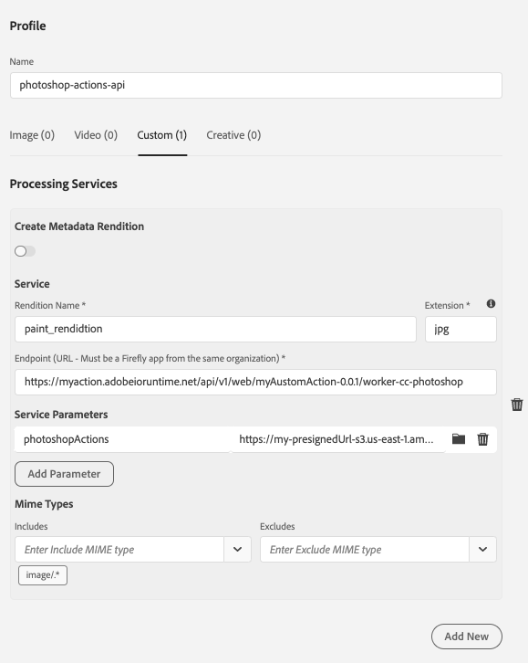

# CC Photoshop Api Worker

## Overview

The CC Photoshop Api Worker wraps the Photoshop APIs to be used by AEM. It is built on top of [aio-lib-photoshop](https://github.com/adobe/aio-lib-photoshop-api).

It provides the following functionality:

- [Run a Photoshop Action](#photoshop-action) on an image

## Enabling the APIs in I/O Console

In order to utilize these APIs, the APIs are added to the existing Asset Compute I/O Console integration that is automatically created by Cloud Manager on behalf of the user. Authentication is done service to service through a JWT created based on the technical account associated with the I/O Console integration. This all done behind the scenes by AEM already. The following APIs exposed in I/O Console are used:

- Photoshop API - Creative Cloud Automation Services

These can be enabled in a AEM Cloud environment by following these steps:

- Log in to <https://console.adobe.io/>
- Switch to the correct organization in the top right corner
- Switch to the Projects page
- Find the AEM Cloud environment, once found click on the AEM Cloud environment
  - You should see the overview page with the Products & Services: I/O Management API, Asset Compute, I/O Events, Experience Platform Launch API, and Asset Compute Journal
- Add _Photoshop API - Creative Cloud Automation Services_:
  - Click on _Add to Project_
  - Select _API_
  - Click on _Photoshop API - Creative Cloud Automation Services_
  - Click on _Next_
  - Select _Service Account (JWT)_
  - Click on _Next_, which takes you to the Create a new Service Account (JWT) credential
    - The public key is already provided
  - Click on _Next_
  - Select _Default Creative Cloud Automation Services configuration_
  - Click on _Save configured API_

## API
### Photoshop Action

Uses the [Photoshop Actions API](https://github.com/adobe/aio-lib-photoshop-api#PhotoshopAPI+applyPhotoshopActions)
REST API: https://adobedocs.github.io/photoshop-api-docs-pre-release/#api-Photoshop-photoshopActions

Supported formats:

- Input: `png`, `jpeg`, `psd`
- Output: `png`, `jpeg`, `psd`

```json
{
    "worker": "<custom-worker-url>",
    "name": "rendition.jpg",
    "fmt": "jpg",
    "photoshopAction": "<presigned-url>"
}
```

You can test using our sample [fisheye photoshop action](./files/fisheye.atn).

#### Example Photoshop Action with multiple actions in the set
If you have an action file with multiple photoshop actions in the set, use the `photoshopActionName` parameter to call only one of the actions.
```
{
    "worker": "https:/mynamespace.adobeioruntime.net/api/v1/web/myactionname/worker-cc-photoshop",
    "name": "rendition.jpg",
    "photoshopAction":"<presigned-url>",
    "photoshopActionName": "Oil Paint Action 1"
}
```
_Note: All actions in the set will be played if none are specified_

## Limitations

- Creative Automation APIs do not support multi-part upload and only support a single URL. This means outputs larger than 100MB on Azure are not currently supported.
- The Creative Processing Profile UI in AEM only supports a single operation
- Only use `.atn` files with one photoshop action in the set


## Setup

Requirements:

- Access to _Photoshop API - Creative Cloud Automation Services_ in the [Adobe Developer Console](https://console.adobe.io).
- [Node.js](https://nodejs.org/en/), version 10 or 12
- [aio cli](https://github.com/adobe/aio-cli)
- [Docker Desktop](https://www.docker.com/products/docker-desktop)

### Create Firefly Project

Review the [Asset Compute Extensibility Documentation](https://experienceleague.adobe.com/docs/asset-compute/using/extend/understand-extensibility.html?lang=en#extend) for more detailed information.

- [Setup a developer environment](https://experienceleague.adobe.com/docs/asset-compute/using/extend/setup-environment.html?lang=en#extend) including the Firefly project
  - Make sure to add _Photoshop API - Creative Cloud Automation Services_ Service Account (JWT) API to the workspaces
- Select your Firefly project
- Select the Workspace where you added the Photoshop API service
- Click on _Download All_ in the top right corner. This will download the _Adobe I/O Developer Console configuration file_

### Deploy

- Download the sources of this repository
- Go to the `worker-cc-photoshop` directory
- Run `npm install`
- Run `aio app use <Path to Adobe I/O Developer Console configuration file>`
  - This will setup your `.env` to point at the Firefly project and workspace
- Run `aio app deploy` to deploy the application

### Review logs

- Use `aio app logs` to review the logs of the most recent invocation

## Integrating with AEM Cloud Service

### Create a Processing Profile

- From the AEM homepage, navigate to Tools -> Assets -> Processing profiles -> Create
- Select the Custom tab
- Add a rendition name and extension
- For _Endpoint URL_, input the URL of the worker as seen after running `aio app deploy`
- Add `` service parameter and set the value to presigned url for a photoshop action
- Click on Save


  
### Associate Processing Profile with Folder

- Select the created Processing Profile
- Click on _Apply Profile to Folder(s)_
- Select a folder
- Click on _Apply_


### End to end test

- Upload a PNG or JPG to the folder that has the _Processing Profile_ associated with it
- Wait for the asset to stop processing
- Click on the asset
- Click on renditions
